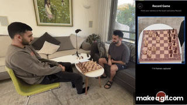

# ScanMate

A mobile app that scans a physical chess board with your phone camera, recognizes the position, tracks moves in real time, and provides Stockfish analysis.

<p align="center">
  
</p>

### 🎥 [Watch the full Video Demonstration](https://www.youtube.com/watch?v=9tf8UBQ1B8c)

---

## Prerequisites

| Tool | Version | Notes |
|---|---|---|
| Python | 3.10 + | `python --version` |
| Node.js | 18 + | `node --version` |
| npm | 9 + | bundled with Node |
| Android Studio / Xcode | latest | for running the app |

---

## 1. Clone & one-time setup

```bash
git clone https://github.com/itayzahor/ScanMate.git
cd ScanMate
```

### ML server (Python / FastAPI)

This project uses [`uv`](https://docs.astral.sh/uv/) for fast, reliable Python package management.

**Install uv** (one-time, any OS):
```bash
# macOS / Linux
curl -LsSf https://astral.sh/uv/install.sh | sh
# Windows (PowerShell)
powershell -c "irm https://astral.sh/uv/install.ps1 | iex"
```

**Set up the venv and install packages:**
```bash
cd ML
uv venv .venv
uv pip install -r requirements.txt
cd ..
```

### Node API server

```bash
cd Server
npm install
cd ..
```

### React Native app

```bash
cd ScanMateApp
npm install
cd ..
```

---

## 2. Download Stockfish

1. Go to https://stockfishchess.org/download/ and download the binary for your OS.
2. Extract it and place the executable inside `ML/engines/stockfish/`.
   The server will automatically find it. Example layout:
   ```
   ML/engines/stockfish/stockfish-windows-x86-64-avx2.exe
   ```

The model weights (`best.pt` files) are **not stored in the repo** due to their size (~326 MB each).
Download them by running the script from the `ML/` directory:

```powershell
cd ML
.\download_models.ps1
```

This places the weights at the paths expected by the server:
```
ML/runs/corners_11x_640_v2/weights/best.pt
ML/runs/pieces_11x_640_v1/weights/best.pt
```

> The script downloads from the [GitHub Releases](https://github.com/itayzahor/ScanMate2/releases) page.
> If the automatic download fails, grab the files from there and place them manually.

---

## 3. Configure the IP address (physical phone)

When running the app on a real device, the phone needs to reach the servers on your computer over your local Wi-Fi network.

Open `ScanMateApp/src/services/config.ts` and set `LAN_HOST` to your computer's local IP:

```ts
// Find your IP:  ipconfig (Windows)  |  ifconfig / ip a (macOS/Linux)
const LAN_HOST = '192.168.1.XX';   // ← replace with your machine's LAN IP
```

| Server | Port |
|---|---|
| ML server (Python) | 8000 |
| Node API server | 4000 |

Both ports must be reachable from the phone — ensure your firewall allows inbound connections on 8000 and 4000.

> **Emulator only?** Leave `LAN_HOST = ''` and the app will use `10.0.2.2` (Android) or `localhost` (iOS simulator) automatically.

---

## 4. Run everything

### One command (Windows)

From the repo root:

```powershell
.\run-all.ps1
```

This opens three separate terminal windows — one per service. Close any window to stop that service.  
Pass `-DebugMode` to enable frame-by-frame dump from the ML server.

### Manual (any OS)

**Terminal 1 — ML server**
```bash
cd ML
# activate venv first (see step 1)
python server.py
```

**Terminal 2 — Node API**
```bash
cd Server
npm run dev
```

**Terminal 3 — React Native app**
```bash
cd ScanMateApp
npx react-native start
```
Then in a fourth terminal run `npx react-native run-android` or `npx react-native run-ios`.

---
